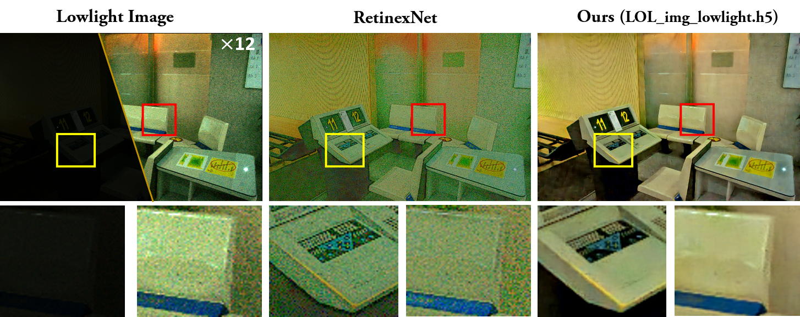
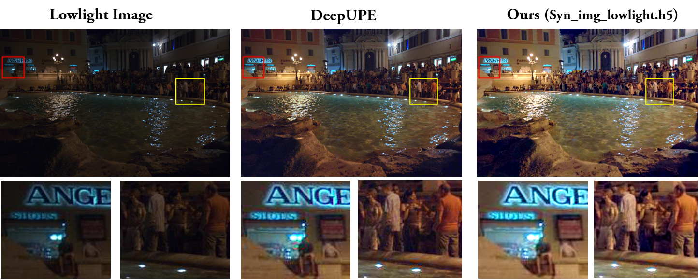

# MBLLEN

This is a Keras implementation of “MBLLEN: Low-light Image/Video Enhancement Using CNNs” in BMVC 2018, by [Feifan Lv](https://lvfeifan.github.io/), [Feng Lu](http://shi.buaa.edu.cn/lufeng/), Jianhua Wu and Chongsoon Lim. This page provides more experiments on real low-light images compared with latest methods.

**[Paper](http://bmvc2018.org/contents/papers/0700.pdf), [Dataset](https://drive.google.com/file/d/1U1hyvVktYEoK_3cdcbWNaJ1WDft2mLRl/view?usp=sharing) and [Project page](http://phi-ai.buaa.edu.cn/project/MBLLEN/index.htm)**


## Requirements ##

- [x] python 3  
- [x] Tensorflow 1.6.0
- [x] Keras 2.2.0
- [x] Opencv-python 3.4.2

## Usage ##

#### Testing
Start jupyter notebook using - 
```
jupyter-notebook \
  --NotebookApp.allow_origin='https://colab.research.google.com' \
  --port=8888 \
  --NotebookApp.port_retries=0
```
To quickly test your own low-light images with our model, you can just run through

```shell
cd main
python test.py -i <input folder> -r <output folder> -m <model name>
```

By default, the code takes the data in the "../input/" folder, loads the "Syn_img_lowlight_withnoise.h5" model and saves results in the "../result/" folder.  Please read the code to see other parameter settings. 

#### Training:

First, prepare your own dataset or download our synthetic low-light dataset from our [Project page](http://phi-ai.org/project/MBLLEN/default.htm). Second, change the load images path of "train.py" and "data_load.py". Then, you can just run through

```shell
cd main
python train.py
```

By default, the code takes the data in the "../dataset/" folder and save weights in the "./models/" folder. Please read the code to see other parameter settings.


## Model

- [x] Syn_img_lowlight_withnoise.h5  (This model is trained using synthetic lowlight images based on Poisson noise model. It is using for enhancement and denoising simultaneously.)
- [x] Syn_img_lowlight.h5  (This model is trained using synthetic lowlight images without additional noise. It is using only for enhancement.)
- [x] LOL_img_lowlight.h5  (This model is fine-tuned using LOL Dataset.)

## Performance on Real Lowlight Images

To obtain better enhancement result, we linearly amplify the output of the network to improve contrast. Please read the code to see other parameter settings. 


##  Performance on [LOL Dataset](https://github.com/weichen582/RetinexNet)

Our LOL fine-tuned version performs well on LOL test images. 



##  Performance on [DeepUPE Dataset](https://github.com/wangruixing/DeepUPE)

Our model is comparable with DeepUPE. Notice that, our models are not fine-tuned using DeepUPE's images (training images are not provided).




## Bibtex

If you use this code for your research, please cite our paper.

 ```
 @inproceedings{Lv2018MBLLEN,
  title={MBLLEN: Low-light Image/Video Enhancement Using CNNs},
  author={Feifan Lv, Feng Lu, Jianhua Wu, Chongsoon Lim},
  booktitle={British Machine Vision Conference (BMVC)},
  year={2018}
}
 ```

## Related Follow-Up Work

Feifan Lv, Yu Li and Feng Lu. Attention Guided Low-light Image Enhancement with a Large Scale Low-light Simulation Dataset. IJCV, 2021. **[Paper](https://arxiv.org/abs/1908.00682) and [Project page](http://phi-ai.buaa.edu.cn/project/AgLLNet/index.htm)**

